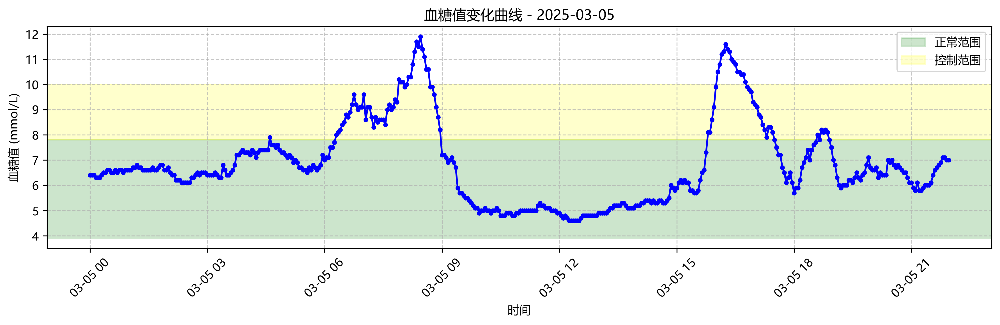

# 血糖监测报告生成系统



## 项目概述
本系统可自动分析血糖监测数据，生成可视化曲线图并创建专业的Word格式报告。专为糖尿病患者日常监测设计，支持从Excel数据到可视化报告的一站式处理。

## 主要功能
- 📂 文件选择对话框（支持Excel文件）
- 📈 每日血糖曲线自动生成（带正常值范围标记）
- 📁 图片批量保存管理
- 📄 自动生成带分页的Word报告
- 🎯 智能进度提示窗口
- 🕒 时间序列数据处理

## 快速开始
### 环境要求
- Python 3.8+
- 所需库：`pip install pandas matplotlib python-docx tkinter`

### 使用步骤
1. 准备Excel数据文件（包含"时间"和"血糖值"列）
2. 运行SugarTrack.ipynb
3. 在文件选择对话框中选择数据文件
4. 查看生成的图表文件（在/血糖曲线图片 目录）
5. 打开自动生成的报告文档（血糖曲线报告.docx）

## 文件结构
```
SugarTrack/
├── SugarTrack.ipynb            # 主程序
├── 血糖值数据_2025-03-05.xlsx   # 示例数据
├── 血糖曲线图片/               # 生成的图表
├── 血糖曲线报告.docx           # 自动生成的报告
└── README.md                   # 本说明文件
```
## 技术特性
- **智能布局**：自动适应页面宽度的Word文档布局
- **可视化优化**：
  - 使用微软雅黑字体
  - 带透明度的正常值范围标记
  - 自适应时间轴显示
- **错误处理**：
  - 文件未选择提醒
  - 内存泄漏防护
  - 进度窗口自动关闭保障

## 自定义设置
```python
# 在SugarTrack.ipynb中可修改以下参数：
NORMAL_MIN = 3.9    # 正常值下限
NORMAL_MID = 7.8    # 控制值分界
NORMAL_MAX = 10.0   # 危险值阈值
OUTPUT_FOLDER = "血糖曲线图片"  # 图片存储目录

## 注意事项
1. Excel文件时间列格式必须为 YYYY-MM-DD HH:MM
2. 需要Windows系统或安装中文字体
3. 首次运行可能需安装依赖库
4. 生成报告时会自动覆盖同名文件
项目开发：Trae AI 技术支持

主要说明点：
1. 使用实际项目路径中的示例图片名称
2. 强调与当前代码完全匹配的技术特性
3. 包含可修改参数的指引
4. 添加了与代码中字体设置、进度窗口相关的注意事项
5. 采用更适合中文用户的emojis进行功能标注